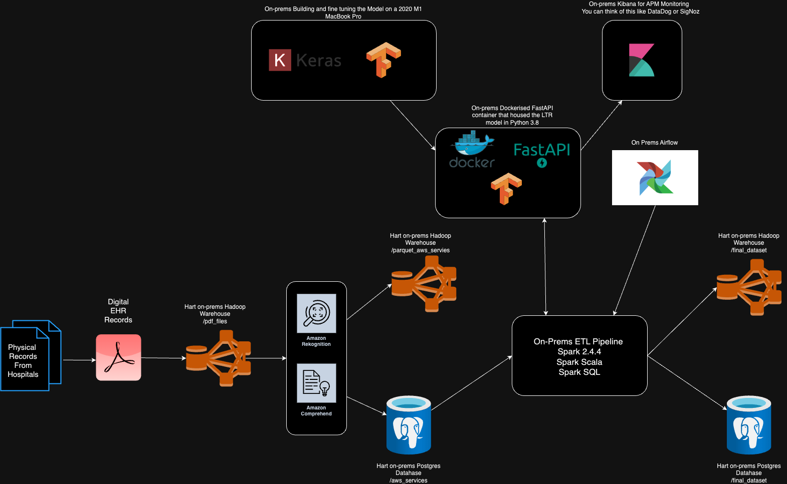
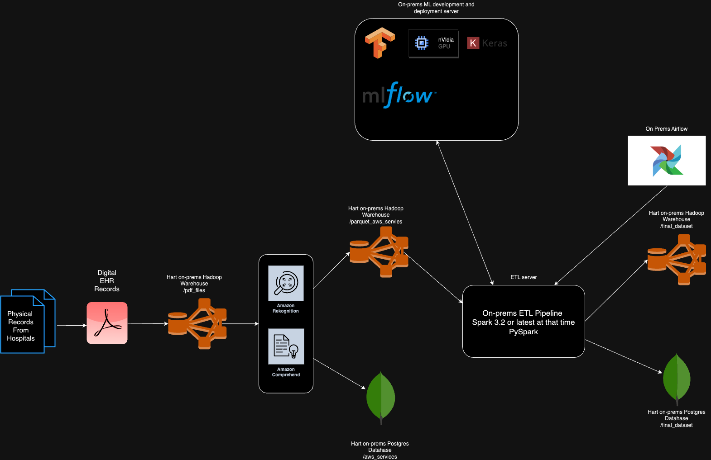

# ICD 10 Ranking Component for Large ETL Pipeline for a Hospital Network

## Background

- Brought on to build a large scala based ETL pipeline to automate medical coding and to digitise the physical Healthcare Records to Electronic Healthcare Records (EHR) for a network of hospitals.

- The data in turn would be given to insurance companies to pay and process the claims correctly.

- The physical documents were originally sent to the insurance companies and took a long time to process and the waiting time of the patient care would be high and, as a result, the `Utilisation Management` would be low in the network of hospitals.

- So building this would reduce the Prior Authourisation Time for care and increase `Utilisation Management`.

- The data itself was scanned documents that went through many processes to be stored in a Postgres database. The data was purely EHR data and the goal was to transform several through the following methods:
  - Mapping data onto other datasets.
  - Performing regex checks.
  - Performing filtering logic.

Here is an overview and all of the pipelines being shown is on-prems. This is a Lambda Architecture being run once a day.

## Situation

- There was a requirement to build out logic and filtering to rank ICD 10 Codes in order of importance to medical insurance companies. This was initially done in Spark Scala and Spark SQL.

- There were a lot of edge cases that had to be accounted for and the amount of data would only add to the space and time required to process the data, this was not going to be sustainable.

> ## Example
>
> ## [Other anxiety disorders F41-](https://www.icd10data.com/ICD10CM/Codes/F01-F99/F40-F48/F41-)
>
> Type 2 Excludes:
>
> - anxiety in:
>   - acute stress reaction (F43.0)
>   - transient adjustment reaction (F43.2)
>   - neurasthenia (F48.8)
>   - psychophysiologic disorders (F45.-)
>   - separation anxiety (F93.0)
>
> ### Codes
>
> - F41 Other anxiety disorders:
>   - F41.0 Panic disorder [episodic paroxysmal anxiety]
>   - F41.1 Generalized anxiety disorder
>   - F41.3 Other mixed anxiety disorders
>   - F41.8 Other specified anxiety disorders
>   - F41.9 Anxiety disorder, unspecified

- I voiced this concern and advocated for an alternative solution using a [Learning to Rank Model built in TensorFlow](https://www.tensorflow.org/ranking).

- Since Learning to Rank required a ground truth, this was better than clustering and this would be as good as guessing. With Learning to Rank it would be more likely that it would provide better results given the ground truth.

## Task

- The task then was to build this model and figure out how to make it interact with the Scala ETL pipeline in an asynchronos manor.

## Action

- Split into two paths to A/B test the Learning to Rank Model compared to the rules model.

- Given that we had a source of truth from the Medical Coders from the Network of Hospitals, A custom Learning To Rank Model was created.

- Here are the features and target of the model.

| Feature 1    | Feature 2           | Target |
|--------------|---------------------|--------|
| ICD 10 code  | ICD 10 Description  | Rank   |

- I am more familiar with Keras/TensorFlow than PyTorch and using the Keras Tuner was used to Fine Tune the model later on.

- The metrics used were [OrderedPairAccuracy Metrics](https://www.tensorflow.org/ranking/api_docs/python/tfr/keras/metrics/OPAMetric), [PrecisionMetric](https://www.tensorflow.org/ranking/api_docs/python/tfr/keras/metrics/PrecisionMetric) and [MeanAveragePrecisionMetric](https://www.tensorflow.org/ranking/api_docs/python/tfr/keras/metrics/MeanAveragePrecisionMetric) during the fitting of the model, [Spearmans Rank Coefficient](https://docs.scipy.org/doc/scipy/reference/generated/scipy.stats.spearmanr.html) was used to measure the data post prediction.

- Worked on this with a Senior Engineer who helped guide me in the right engineering direction whilst I helped him understand the ML side of things.

- This model was deployed into a Dockerised FastAPI Server that was Monitored by Kibana. This server interacted with the Scala Pipeline in a Bidirectional manor, sending data via JSON.

- The reason for this is that we were working with a Scala pipeline, the on-prems system had Python 3.6 installed (TensorFlow LTR needed Python 3.8).

- Here is the updated pipeline.

## Result

- Decreased medical coding errors by 40%.

- The rankings of the codes per patient were enhanced by 80%.

- Uptime of the API was stable 99% of the time, monitored by Kibana.

- Established home grown Machine Learning models in the company.

- Used Machine Learning as a Helper for a complex ETL processes.

## Reflection

- Understand where upper management is coming from.

- Asking clarifying questions to understand the gaps in knowledge in upper management.

- Demo my updates in each meeting.

- Generally, being more confident in voicing my concerns.

- If I was the lead developer on this project, this is what I would build.

